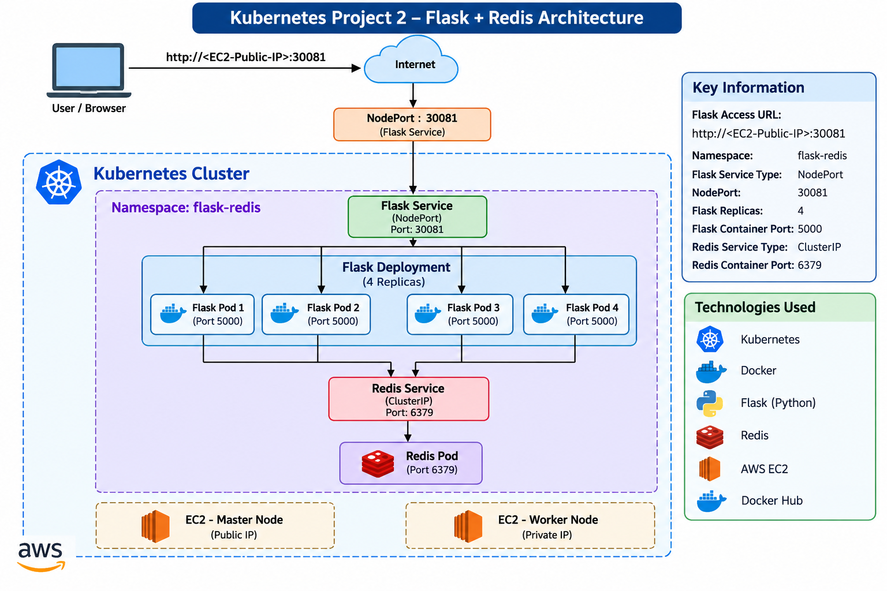

# Kubernetes Project 2 – Flask + Redis Multi-Container Application

## Project Overview

This project demonstrates how to deploy a multi-container application on Kubernetes using a Flask web application and Redis as the backend data store.

The project takes a Flask + Redis application and deploys its components on Kubernetes. It demonstrates Kubernetes Deployments, Pods, Services, service discovery, environment variables, NodePort access, Docker image management, scaling, and rolling updates.

## Architecture

                         Internet / Browser
                                |
                                |
                         NodePort :30081
                                |
                                v
                    +------------------------+
                    |   Flask Service        |
                    |      NodePort          |
                    +------------------------+
                                |
                                v
                    +------------------------+
                    |   Flask Deployment     |
                    +------------------------+
                       |       |       |       |
                       v       v       v       v
                    Flask    Flask    Flask    Flask
                    Pod 1    Pod 2    Pod 3    Pod 4
                       \       |       |       /
                        \      |       |      /
                         \     |       |     /
                          v    v       v    v
                    +------------------------+
                    |    Redis Service       |
                    |       ClusterIP        |
                    +------------------------+
                                |
                                v
                    +------------------------+
                    |      Redis Pod         |
                    |        :6379           |
                    +------------------------+

## Technologies Used

- Kubernetes
- Docker
- Docker Hub
- Flask
- Python
- Redis
- AWS EC2
- Kubernetes Deployments
- Kubernetes Services
- NodePort
- ClusterIP
- Kubernetes DNS / Service Discovery

## Project Structure

    kubernetes-project-2-flask-redis/
    │
    ├── README.md
    ├── architecture-diagram.png
    ├── app.py
    ├── requirements.txt
    ├── Dockerfile
    ├── flask-deployment.yaml
    ├── flask-service.yaml
    ├── redis-deployment.yaml
    └── redis-service.yaml

## Application Components

### Flask Application

The Flask application provides the web interface and displays the visitor count.

The application connects to Redis using the Kubernetes Service name:

    redis-service

The Redis hostname is provided to Flask through an environment variable:

    REDIS_HOST=redis-service

This allows the Flask application to communicate with Redis without using the Redis Pod IP address directly.

### Redis

Redis stores the visitor count generated by the Flask application.

Redis runs inside the Kubernetes cluster and is exposed using a ClusterIP Service.

Redis is not directly exposed to the internet.

## Kubernetes Namespace

A dedicated namespace was created for the project:

    flask-redis

This keeps all resources related to the project organized within their own Kubernetes namespace.

## Redis Deployment

Redis is deployed using a Kubernetes Deployment:

    redis-deployment

The Redis container listens on port:

    6379

## Redis Service

Redis is exposed internally using a ClusterIP Service:

    redis-service

The Flask application communicates with Redis through:

    redis-service:6379

Kubernetes DNS resolves the Service name to the Redis Service, providing service discovery inside the cluster.

## Flask Deployment

The Flask application is deployed using:

    flask-deployment

The initial deployment contains 2 replicas.

The Flask application uses the Docker image:

    10messiaws/flask-k8s-app:1.0

The image is stored in Docker Hub and pulled by Kubernetes when creating the Flask Pods.

## Flask Service

The Flask application is exposed externally using a NodePort Service:

    flask-service

The NodePort used is:

    30081

The application can be accessed using:

    http://<EC2-PUBLIC-IP>:30081

An AWS EC2 Security Group inbound rule was configured to allow TCP traffic on port 30081.

## Kubernetes Networking

Unlike the original Docker implementation, no manually created Docker network is required.

Kubernetes provides cluster networking automatically.

Kubernetes Services provide stable networking and service discovery between application components.

The Flask application connects to Redis using:

    REDIS_HOST=redis-service

Therefore, Flask does not need to know the changing IP address of the Redis Pod.

## Docker Image

The Flask application was packaged into a Docker image:

    flask-k8s-app:1.0

The image was tagged for Docker Hub as:

    10messiaws/flask-k8s-app:1.0

The image was then pushed to Docker Hub so that Kubernetes worker nodes could pull the image.

## Scaling

The Flask Deployment was initially configured with 2 replicas.

It was then scaled to 4 replicas using:

    kubectl scale deployment flask-deployment --replicas=4 -n flask-redis

The final application state contains:

    4 Flask Pods
    1 Redis Pod

This demonstrates Kubernetes horizontal scaling at the Deployment level.

## Rolling Updates

The Flask Deployment also demonstrates Kubernetes rolling updates.

The application image can be updated through the Deployment, allowing Kubernetes to gradually replace the existing Pods with new Pods while maintaining application availability.

## Key Kubernetes Concepts Demonstrated

- Namespace isolation
- Kubernetes Pods
- Deployments
- Replica management
- ClusterIP Services
- NodePort Services
- Kubernetes DNS
- Service discovery
- Environment variables
- Docker image management
- Docker Hub
- AWS EC2
- External application access
- Horizontal scaling
- Rolling updates
- Kubernetes networking
- Multi-component application deployment

## Project Flow

The complete application flow is:

    Browser
       |
       v
    Flask NodePort Service
       |
       v
    Flask Deployment
       |
       +---- Flask Pod 1
       +---- Flask Pod 2
       +---- Flask Pod 3
       +---- Flask Pod 4
       |
       v
    Redis ClusterIP Service
       |
       v
    Redis Pod

When a user accesses the application, the request reaches the Flask Service through NodePort.

The Flask application processes the request and communicates with Redis through the Redis Service.

Redis increments and stores the visitor count, which is then displayed by the Flask application.

## Learning Objectives

This project was created to understand how Kubernetes can orchestrate a multi-component application.

The project demonstrates:

1. Deploying multiple application components on Kubernetes.
2. Using Deployments to manage Pods.
3. Using ClusterIP for internal communication.
4. Using NodePort for external access.
5. Using Kubernetes DNS for service discovery.
6. Passing configuration using environment variables.
7. Using Docker Hub as a container image registry.
8. Scaling an application from 2 to 4 replicas.
9. Performing rolling updates.
10. Understanding Kubernetes networking without manually creating Docker networks.

## Result

The Flask + Redis application was successfully deployed on Kubernetes.

The Flask application was accessible externally through the NodePort Service.

The visitor count was successfully maintained by Redis.

The Flask application was successfully scaled from 2 replicas to 4 replicas.

The final architecture demonstrates a Kubernetes-based multi-component application with external access to Flask and internal service communication between Flask and Redis.

## Project Type

Cloud / DevOps / Kubernetes Project

## Learning Outcome

This project provided practical experience with deploying a real multi-component application on Kubernetes and understanding how Kubernetes Services, Deployments, networking, service discovery, container images, scaling, and rolling updates work together.
